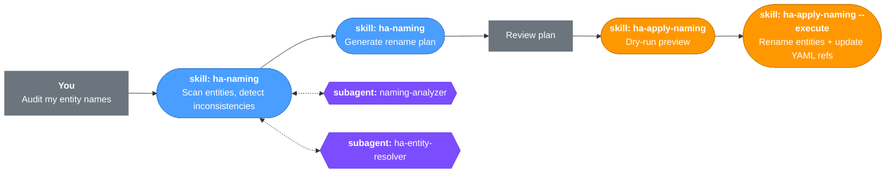

# Home Assistant Assistant

A [Claude Code](https://docs.anthropic.com/en/docs/claude-code) plugin that lets you manage your Home Assistant setup through natural language. Describe what you want — automations, scripts, scenes, dashboards, naming conventions — and the plugin generates device-aware YAML, resolves entity names against your real HA instance, validates everything, and deploys via git with confirmation at every step.

## Quick Start

Add the marketplace and install the plugin:

```
/plugin marketplace add Benny-Lewis/home-assistant-assistant
/plugin install home-assistant-assistant@home-assistant-assistant
```

Then run `/ha-onboard` — the setup wizard walks you through installing hass-cli, creating an access token, setting environment variables, connecting to Home Assistant, and configuring git-based deployment.

## What Can It Do?

**You can ask for these directly:**

| Skill | What it does |
|-------|-------------|
| ha-onboard | First-time setup — connect to HA, verify prerequisites, configure settings |
| ha-validate | Check your configuration for errors with evidence tables showing what was checked |
| ha-deploy | Deploy changes to HA via git commit + push + reload (with confirmation at each step) |
| ha-analyze | Analyze your setup and get improvement suggestions |
| ha-naming | Audit naming conventions, plan renames |
| ha-apply-naming | Execute a naming plan (dry-run by default) |

**These activate automatically** when you ask about their domain:

| Skill | Domain |
|-------|--------|
| ha-automations | Triggers, conditions, actions, automation modes |
| ha-scripts | Script sequences, modes, fields |
| ha-scenes | Scene creation with capability verification |
| ha-config | Configuration structure, packages, secrets |
| ha-lovelace | Dashboard cards, layouts, themes |
| ha-jinja | Template syntax, filters, state access |
| ha-devices | Device types, integrations, new device workflows |
| ha-troubleshooting | Log analysis, debugging, common errors |

## Usage Examples

### Create an automation

> "Create an automation that turns off the living room lights 5 minutes after no motion is detected"

The plugin classifies this as an inactivity pattern (not a simple delay), generates a `state` trigger with `for:` duration, and verifies the motion sensor and light entities exist.

### Set up a new device

> "I just added a Zigbee motion sensor in the garage"

The plugin suggests a name following your conventions, recommends automations (motion-triggered lights, alerts), offers dashboard integration, and checks for related devices.

### Design a dashboard

> "Create a dashboard card showing the temperature and humidity in each room"

The plugin resolves your climate sensors, checks their available attributes, and generates a Lovelace card configuration.

### Deploy changes

```
/ha-deploy
```

Shows a diff of what changed, asks for confirmation, commits, pushes, and triggers HA to reload — with a confirmation gate before each step.

## How It Works


**Blue** = skills &nbsp;&nbsp; **Purple** = subagents (spawned as needed) &nbsp;&nbsp; **Orange** = deploy (confirmation-gated) &nbsp;&nbsp; **Gray** = you

Each step includes guardrails: entities are verified against your real HA instance, device capabilities are checked before generating attributes, and deployment requires explicit confirmation.

### Naming Audit & Rename



### Troubleshooting


### Configuration Review


## Prerequisites

- [Claude Code](https://docs.anthropic.com/en/docs/claude-code) CLI
- Git
- A running Home Assistant instance

Everything else (hass-cli, access token, environment variables, Git Pull add-on) is set up by `/ha-onboard`.

## Architecture

See [COMPONENTS.md](COMPONENTS.md) for detailed documentation of every skill, agent, and hook.

```
├── .claude-plugin/
│   └── plugin.json               # Plugin manifest
├── skills/
│   ├── ha-automations/           # Automation creation + domain knowledge
│   ├── ha-scripts/               # Script creation + domain knowledge
│   ├── ha-scenes/                # Scene creation with capability checks
│   ├── ha-config/                # Configuration organization
│   ├── ha-jinja/                 # Jinja templating
│   ├── ha-lovelace/              # Dashboard design
│   ├── ha-naming/                # Naming conventions + audit
│   ├── ha-apply-naming/          # Naming plan execution
│   ├── ha-devices/               # Device knowledge + setup workflows
│   ├── ha-troubleshooting/       # Debugging + log analysis
│   ├── ha-onboard/               # Setup wizard
│   ├── ha-deploy/                # Git-based deploy + rollback
│   ├── ha-validate/              # Configuration validation
│   ├── ha-analyze/               # Setup analysis + recommendations
│   └── ha-resolver/              # Entity resolution (used by agents)
├── agents/
│   ├── config-debugger.md        # Analyzes and fixes configuration errors
│   ├── ha-config-validator.md    # Deep configuration validation
│   ├── ha-entity-resolver.md     # Entity resolution for other agents
│   ├── ha-log-analyzer.md        # HA log analysis
│   ├── device-advisor.md         # Device setup recommendations
│   └── naming-analyzer.md        # Naming pattern analysis
├── hooks/
│   ├── hooks.json                # SessionStart, PostToolUse hooks
│   └── session-check.js          # Environment verification on session start
├── references/
│   ├── safety-invariants.md      # Safety rules referenced by all skills
│   ├── settings-schema.md        # Settings file schema
│   └── hass-cli.md               # hass-cli reference
└── templates/
    └── templates.md              # Reference templates for generated configs
```

## Configuration

The plugin stores user-specific configuration in `.claude/` (gitignored):

- **`settings.local.json`** — connection settings, HA config path, feature flags
- **`ha.conventions.json`** — your naming patterns (learned from your setup or defined manually)
- **`naming-plan.yaml`** — generated rename plans (from `/ha-naming`)

## License

[MPL-2.0](LICENSE)
