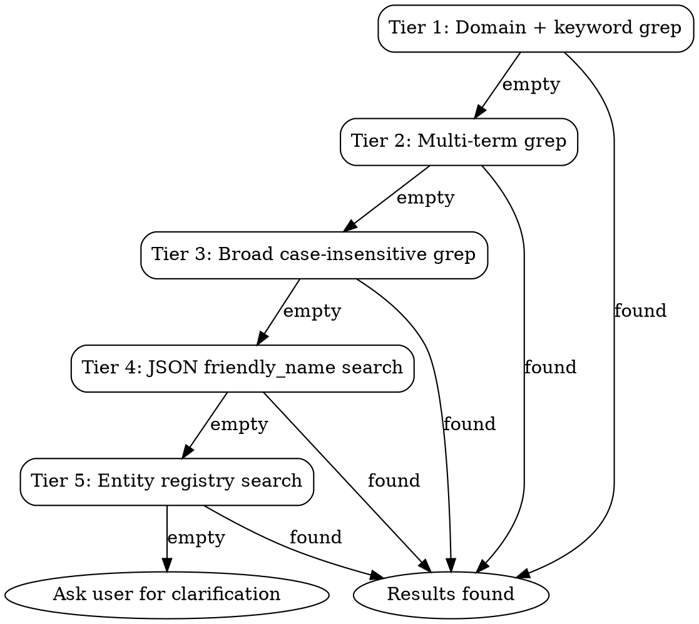

# Enhanced Entity Search

Tiered search escalation for finding entities when a simple grep fails.

## Search Escalation Flowchart



## Tier 1: Domain + Keyword (Fastest)

Use when you know the domain and have a keyword (e.g., "kitchen light").

```bash
hass-cli state list | grep "^light\." | grep -i "kitchen"
```

Covers most lookups. Always start here.

## Tier 2: Multi-Term Search

Split user query into terms, chain grep to intersect results.

```bash
# "hallway motion sensor" → 3 terms
hass-cli state list | grep -i "hallway" | grep -i "motion"
```

Drop generic terms like "sensor" or "light" if they match too broadly — they're implicit in the domain filter from Tier 1.

## Tier 3: Broad Case-Insensitive

Search entire state list with a single loose term.

```bash
hass-cli state list | grep -i "kitchen"
```

Returns all domains. Useful when the user's description doesn't map cleanly to a domain (e.g., "kitchen stuff").

## Tier 4: JSON Friendly Name Search

Default tabular output only shows entity_id. Friendly names may differ significantly from entity_ids (e.g., entity `sensor.lumi_abc123` has friendly_name "Kitchen Temperature").

```bash
hass-cli -o json state list | grep -i "kitchen"
```

This searches across JSON output including `friendly_name` in attributes. Output is verbose — pipe through `grep -B2 -A5` to extract context around matches.

## Tier 5: Entity Registry Search

The entity registry contains `original_name`, `aliases`, and other metadata not visible in state output.

```bash
hass-cli -o json entity list
```

Pipe through `grep -i "<query>"` to search across entity_id, original_name, and aliases fields. This is the most comprehensive search but returns the most data.

## Tips

- **Don't skip tiers** — each is progressively slower and noisier
- **Iterate, don't guess** — if Tier 1 returns nothing, try Tier 2 before asking the user
- **Combine with area search** — if the user mentions a room, use `references/area-search.md` instead of escalating through name-based tiers
- **Note the search method** in evidence tables so the caller knows how results were found
